# LAN9253-EtherCAT驱动逻辑说明

本说明基于致远电子 [DPort-ECT-Pro](https://www.zlg.cn/power/power/product/id/359.html) ESC及其 [EPC103-DP评估板例程](https://axpi.zlgcloud.com/#/Container/Product/ProductDetail?id=204)进行验证，

结合微芯 [LAN9253-Data-Sheet-DS00003421.pdf](https://ww1.microchip.com/downloads/aemDocuments/documents/UNG/ProductDocuments/DataSheets/LAN9253-Data-Sheet-DS00003421.pdf) ，对LAN9253-EtherCAT驱动逻辑进行阐述。

------

## 1. SPI通信指令与配置

### 1.1 读写指令详解

驱动中使用的读写指令为 快速读FASTREAD（0Bh）、写WRITE（02h），也可使用 读READ（03h）。

#### 1.1.1 FASTREAD快速读(0Bh)

要点：

-   1 or 2Byte的长度信息；
-   至少1个DummyByte；
-   最高80MHz SCK频率。

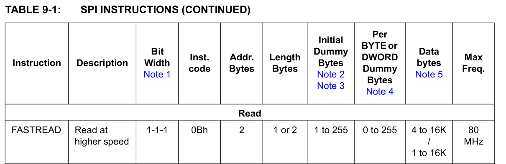

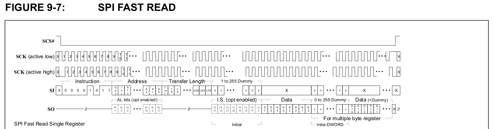

#### 1.1.2 WRITE写(02h)

要点：

-   不能有DummyByte，否则会解析成数据；
-   最高80MHz SCK频率。

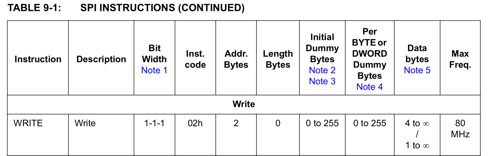

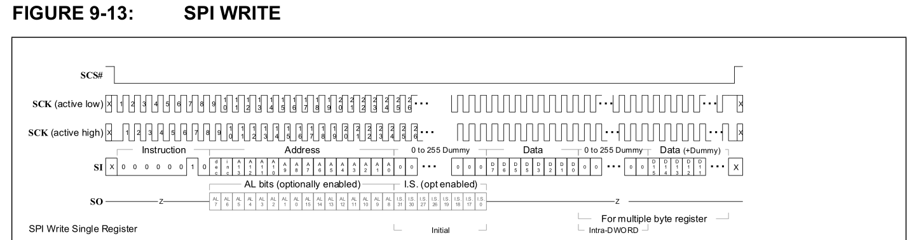

#### 1.1.3 READ读(03h)

要点：

-   数据阶段MOSI保持拉低，发送最后一个字节时拉高；
-   最高30MHz SCK频率。

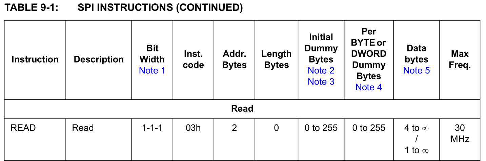

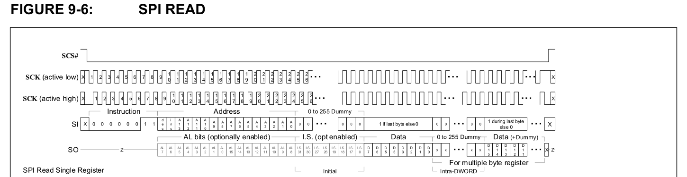

### 1.2 通信前配置

#### 1.2.1 验证初始化完成

硬件初始化完成时，**BYTE_TEST( 3064h)** 寄存器的值会被设置为0x87654321，否则返回高电平。

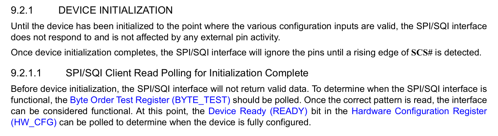

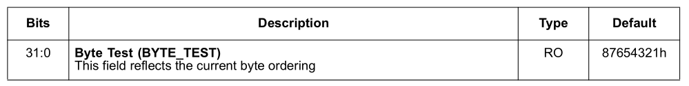

#### 1.2.2 写入DummyCycle配置

为确保有足够的时间来读取寄存器数据（特别是在以 EtherCAT 直接映射模式运行时从 EtherCAT Core CSRs 或 Process RAM 中读取数据时）需要使用 DummyBytes 循环。

DummyByte数量通过**SETCFG**指令进行设置，并根据读取命令类型进行指定。

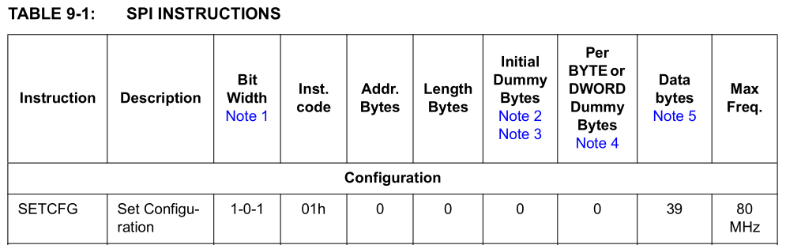

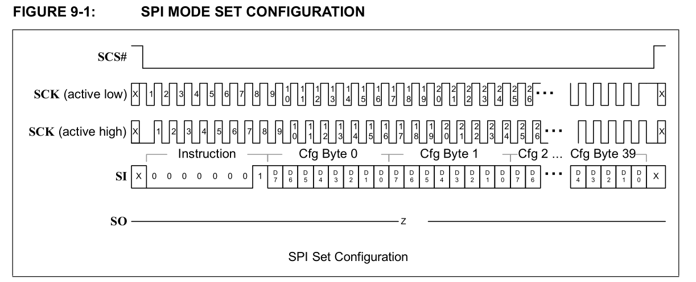

一般默认出厂已写入如下的DummyBytes配置，在驱动中无需再次使用SETCFG写入。

```c
uint8_t __g_dummy_cnt_arr[39] =
      { 0,0,0,1,0,0,1,0,0,2,
        0,0,1,0,0,4,0,0,0,0,
        0,0,0,0,0,0,0,0,0,0,
        0,0,0,3,0,0,0,0,0};
```


## 2. 地址参数处理

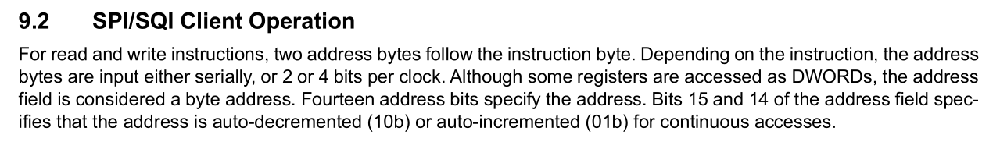

输入参数address的最高两位[15:14] dec/inc 用于配置自动递增/减功能：

​	**00**：constant DWORD aligned address

​	**01**：**incrementing** DWORD aligned starting address

​	**10**：**decrementing** DWORD aligned starting address

​	**11**：RESERVED

使用读取指令时，若读取数据长度大于DWORD时，需要启用自动递增功能，否则只返回起始地址DWORD长度的数据。

```c
	/* Set address[15:14] = 01, Enable Auto-increment */
	address |= 0x4000;
```

*经测试若不启用递增(11)也可正常写入数据。*


## 3. 数据长度参数处理

### 3.1 FASTREAD的长度参数

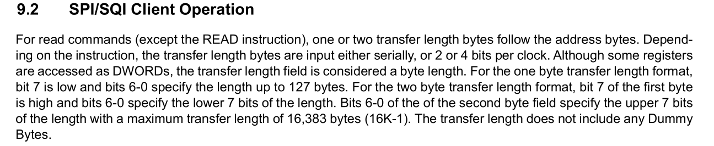

与**READ**指令相比，**FASTREAD**指令额外需要1或2个字节的长度参数。

数据长度 <= 127字节时，长度参数为**单字节**；

数据长度 > 127 字节时，长度参数为**双字节**。

-   单字节传输长度格式：Bit 7 为 0，而Bit [ 6 : 0 ] 则指定长度可达 127（0x7F）个字节；
-   两字节的传输长度格式：
    第一个字节 Bit 7 为 1，而Bit [ 6 : 0 ] 则表示长度的最低 7 位；
    第二个字节指定长度的最高 7 位，最大传输长度为 16383 字节（16K - 1）。

```c
	if(len > 0x7F){
        cmd_buffer[cmd_index++] = (uint8_t)(len & 0x7F) | 0x80;
        cmd_buffer[cmd_index++] = (uint8_t)((len >> 7) & 0x7F);
    }else{
        cmd_buffer[cmd_index++] = len;
    } 
```


### 3.2 非核心CSR寄存器对齐访问


对将要进行读写操作的地址作映射分区判断，若访问非Core CSRs需进行长度参数处理，以满足DWORD对齐访问的要求。

```c
 	/* Core CSR and Process RAM accesses can have any alignment and length */
    if (address < 0x3000){
        ...
    }
    else {
        /* Non Core CSR length will be adjusted if it is not DWORD aligned */
        u32ModLen = len % 4; 
        if      (1 == u32ModLen)len = len + 3; 
        else if (2 == u32ModLen)len = len + 2;
        else if (3 == u32ModLen)len = len + 1;
    }
```


## 4. DummyByte配置


DummyByte的核心作用是**产生必要的时钟周期**以满足设备时序要求，使从设备能够输出数据或完成状态转换，而非传输实际数据，具体MOSI发送的值并无要求。

驱动中如下添加DummyByte:

```c
	uint8_t dummy_clk_cnt = __g_dummy_cnt_arr[SPI_FASTREAD_INITIAL_OFFSET];
    ......
	while (dummy_clk_cnt--)
    {
        cmd_buffer[cmd_index++] = 0x88;
    }
```

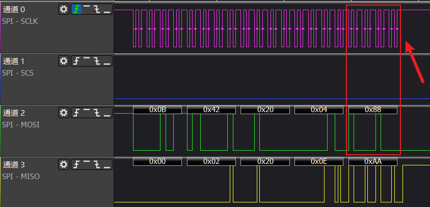

*图中DummyByte值为STM32外设经典值0x88。*


## 5. 读时序数据阶段前空闲处理

经测试使用**完全连续**的SPI CLK时钟周期时，无法正确稳定地读取数据，需要在读取第一位数据前空闲一段时间（SPI总线不产生任何信号）。

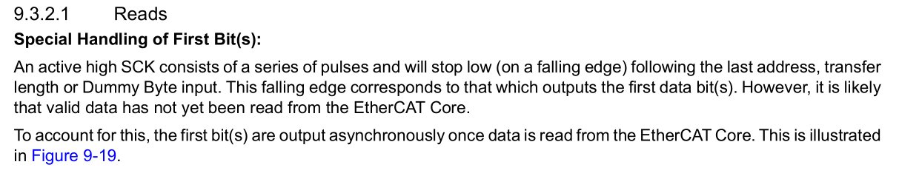

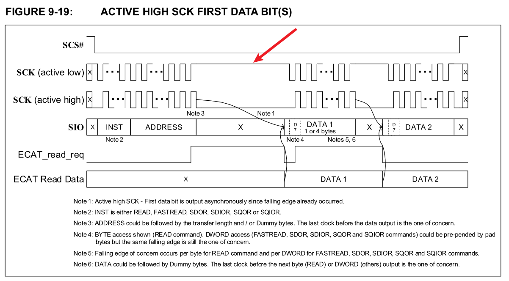

故驱动中使用两次传输，引入了一段空闲间隔。

```c
	__g_esc_obj->pfn_spi_cs_select();
    __g_esc_obj->pfn_spi_write(cmd_buffer, cmd_index);
    __g_esc_obj->pfn_spi_write_and_read(tx_buffer, __g_data_buf, len);
    __g_esc_obj->pfn_spi_cs_deselect();
```

最终FASTREAD读取DWORD长度数据的时序如下：

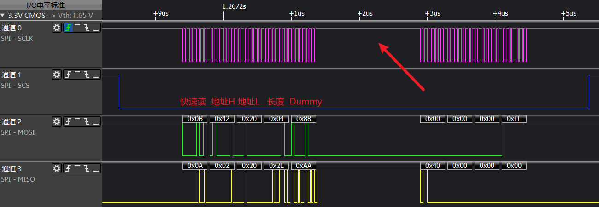


## 6. SQI模式

### 6.1 启用SQI前SPI指令及时序

启用SQI模式前，需要在**SPI**模式下使用的指令如下图：

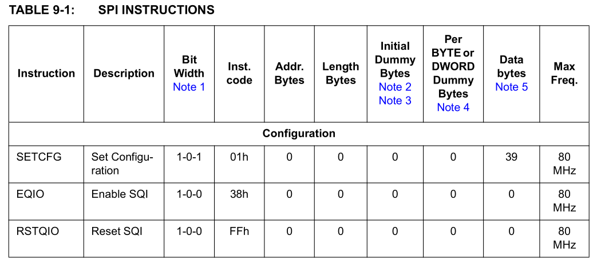


-   使能SQI模式为单线 **EQIO** 指令，指令码为 **0x38**，时序见文档图9-3，如下图：

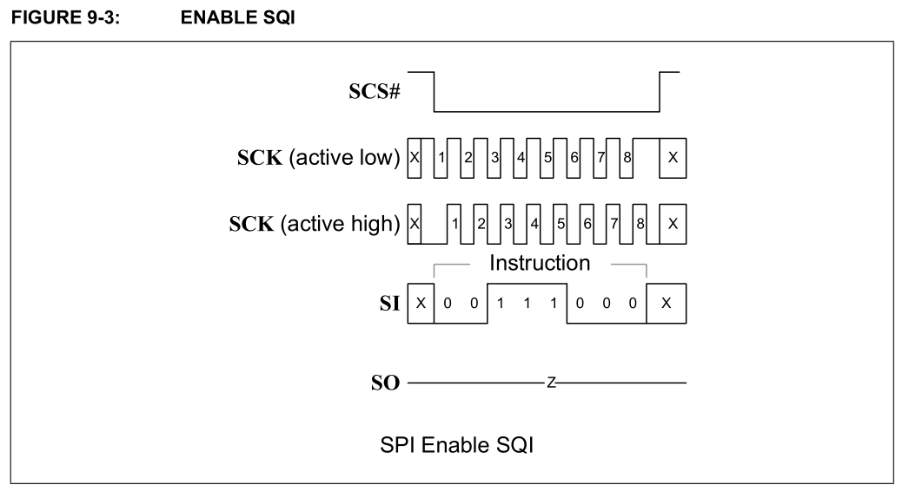


-   在SPI模式下复位SQI为单线 **RSTQIO** 指令，指令码为 **0xFF**，时序见文档图9-4，如下图：


### 6.2 SQI指令及时序

在**SQI**模式下使用的指令如下图：


-   在SQI模式下复位SQI为四线 **RSTQIO** 指令，指令码为 **0xFF**，时序见文档图9-5，如下图：

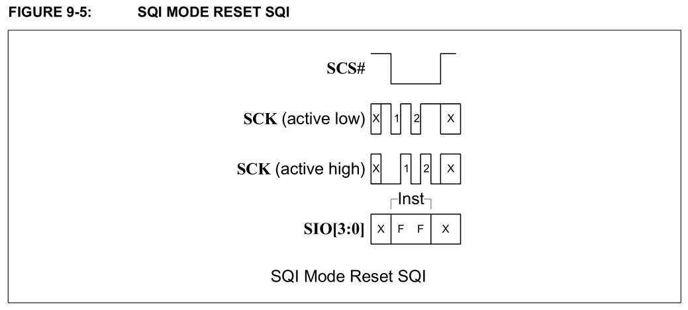


-   SQI读为四线 **FASTREAD** 指令，指令码为 **0x0B**，时序见文档图9-8，如下图：

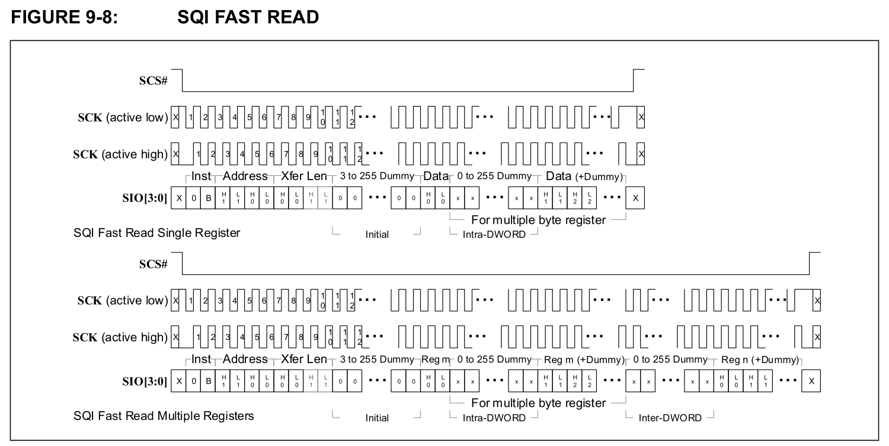


-   SQI写为四线 **WRITE**模式，指令为 **0x02**，时序见文档图9-14，如下图：

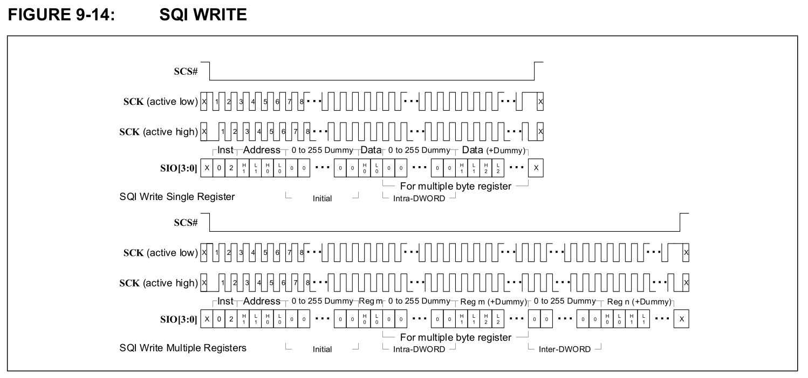


### 6.3 SQI使能步骤

按照以下步骤进入SQI模式：

1.   分别发送SPI模式和SQI模式的复位指令（FFh），从任意模式回到SPI模式（SPI/SQI -> SPI）；
2.   在SPI模式下，读取 BYTE_ORDER（3064h） 确认外设初始化完毕；
3.   在SPI模式下，发送SQI使能指令（38h），进入SQI模式；
4.   使用SQI读（02h）和写（0Bh）指令进行SQI通信。

